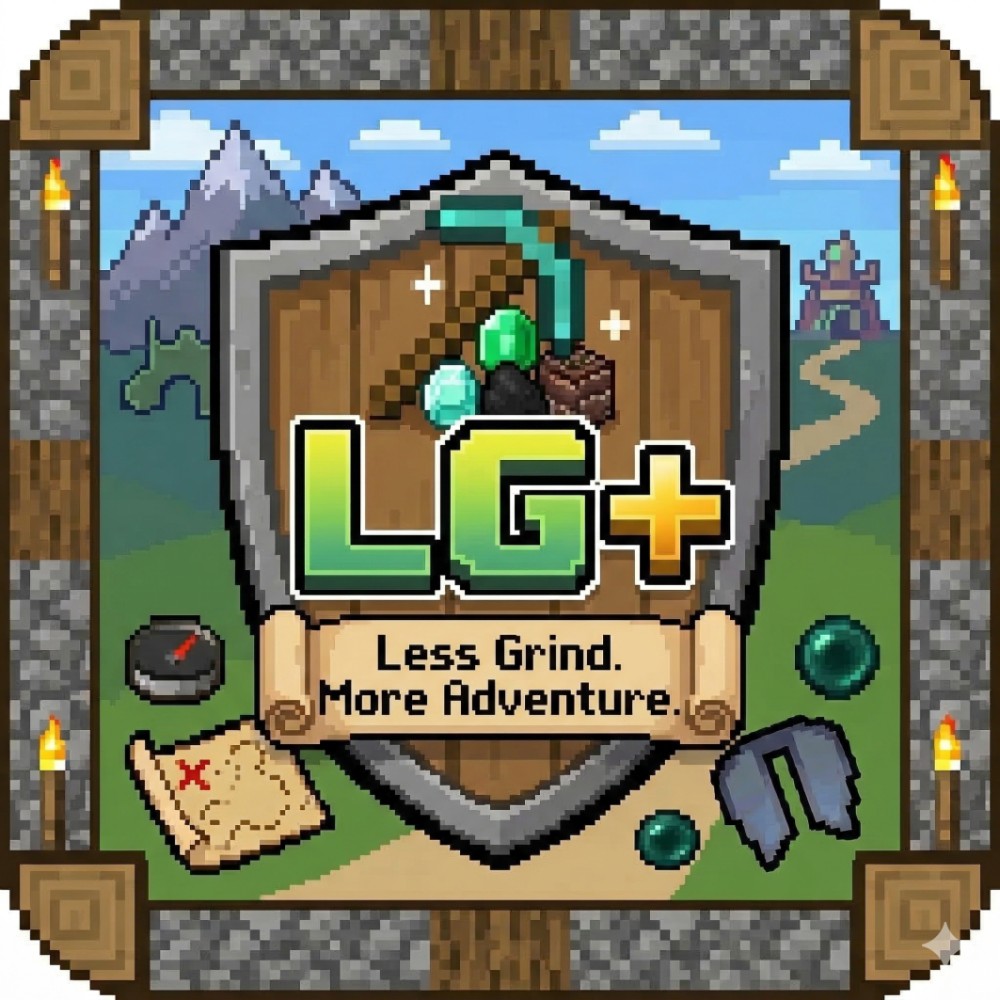

# LessGrind+
A vanilla+ mod pack aimed at improving basic game play mechanics that reduce unnecessary grind and make the game feel more interesting.

## [Available on Modrinth](https://modrinth.com/modpack/lessgrindplus)

# A Vanilla+ modpack with three goals in mind.

1. Reduce _needless_ grind in Minecraft. It isnt a fast track to the end game, but a reduction to some tedious repetitive aspects of the game that get annoying.
2. Extra adventure. Addition structures, biomes, dimensions and resource packs that add to the experience.
3. Keep that classic Minecraft feel. We know its modded, but this _could_ be in the base game.

All the mods, data packs and resource packs will be listed in the below categories explaining their purpose for being included.
You can find information for [Previous Versions](https://github.com/birdwing/Minecraft-LessGrind-Plus/blob/main/PreviousVersions.md) at the github page.

# Current Version 2.0.3+26.1.2
## Reduce _Needless_ Grind
### Gameplay Changes
- [Wind Boost Enchantment](https://modrinth.com/datapack/wind_boost_enchant)
  Happy Ghasts are so cute! But *sooo sloooow*. Ever wish you could speed them up? Well now you can! You can now enchant their harness with Wind Boost to make the Happy Ghasts Faster!
- [Quick Right-Click](https://modrinth.com/mod/quick-right-click)  
  Place, use, break. Place, use... break. Place... use.. break. Tired of having to Place, use then break things out of your inventory? Well, now you can right click into the air with your crafting bench to use it! No placing necessary!
  

More Blocks!
This also words with: <ul><li>Beds</li><li>Cartography Tables</li><li>Crafting Tables</li><li>Ender Chests</li><li>Grindstones</li><li>Shulker Boxes</li><li>Smithing Tables</li><li>Stonecutters</li></ul>

- [Gravestones](https://modrinth.com/mod/pneumono_gravestones)  
  Dying sucks, losing your items sucks worse and "keep inventory" is cheating. The solution, graves! Now when you fail to survive, a grave will spawn to keep your items safe for you to find them. You can also craft decorative ones for your pet graveyard.
- [Simple Voice Chat](https://modrinth.com/plugin/simple-voice-chat)  
  Communicate with each other _right from inside minecraft_! Location based voice communication is now possible.  
  

More Info & Keybinds
Press the <kbd>V</kbd> to configure Voice chat. You can setup <i>push to talk</i> or <i>voice detection</i> and also configure the volumes for individual players. Press the <kbd>X</kbd> key to Mute/Unmute. Press the <kbd>G</kbd> to create and join groups. Groups allows you to communicate without needing to be in range of each other.

- [Zoomify](https://modrinth.com/mod/zoomify)  
  Yep... lets you see things further away with the <kbd>C</kbd> key. Get it "c"...
- [LambDynamicLights - Dynamic Lights](https://modrinth.com/mod/lambdynamiclights)  
  Do we really _always_ need to place down torches to see, and waste coal? Not with this mod! Just hold a torch or other _glowy items_ in your hand!
- [Fortunate Ancient Debris](https://modrinth.com/datapack/fortunate-ancient-debris)  
  What's the point in a fortune pickaxe if it doesn't work when gathering netherite? Well... now it does.  
  

More Info

    Ancient Debris now drops netherite scrap, how much it drops is affected by the fortune enchantment. You can still get the Ancient Debri's block with silk touch.  
    **For Balance:** Because fortune now works, it will take 5 netherite scrap to make one ingot of netherite instead of 4, and you do not get XP from mining Ancient Debris.
  

- [Trade Cycling](https://modrinth.com/mod/trade-cycling)  
  Everyone rolls villagers to get the trades that they want. Placing, breaking and re-placing their workstations is a hassle. Now there is a button that does it for you!  
  

More Info
When you trade with a villager <i>that nobody has traded with before</i> there is now a button that rolls their trades. This is so you don't have to keep placing and breaking workstation blocks. Once you trade with the villager, the button goes away.

- [Scaffolding Drops Nearby](https://modrinth.com/mod/scaffolding-drops-nearby)  
  Do you hate that when you break scaffolding you have to run around and pick it all up? Well now, when you break it all the blocks will drop right where you are! No more running around playing "find the scaffolding".
- [Boat Item View](https://modrinth.com/mod/boat-item-view)  
  Ever try and follow a map or compass while in a boat? Well, now you can continue to see them while the boat is moving! Congrats, you unlocked "holding things in your lap".
- [No Animal Tempt Delay](https://modrinth.com/mod/no-animal-tempt-delay)  
  Animals are no longer picky about their food! They will always follow you when you hold it, no more waiting for that cow to examine the wheat before deciding to follow you.
- [GravelMiner](https://modrinth.com/mod/gravelminer)  
  Strip mining and run into a section of gravel. Tired of using the "break block and quickly place torch" trick? Now breaking a block under falling gravel _(or sand)_ will instantly break all the falling gravel _(or sand)_ above it! No torch required.
- [AppleSkin](https://modrinth.com/mod/appleskin)  
  Makes the food related HUD show you more information such as your saturation level, and how much hunger a piece of food will fill up.
- [Better Spawner Control](https://modrinth.com/mod/better-spawner-control)  
  Is there enough light to keep this mob spawner turned off? Well, guess no more! Places 5 torches on the spawner, four sides and the top, will disable the spawner. No more guess work so you can make your mob farms in peace.
- [Harvest With Ease](https://modrinth.com/mod/harvest-with-ease)  
  Farming is difficult. First you have to break the crop.. then replant. What if there was a tool to make this easier? Your hoe is now upgraded! Right clicking a crop with a hoe will now harvest and replant the crop for you!  
  

More Info
The better your hoe the faster you can farm! 
    <ul>
      <li>Wood, stone and copper will harvest and replant 1 crop at a time.</li>
      <li>Iron will harvest and replant in a 3x3 area.</li>
      <li>Gold will harvest and replant in a 5x5 area.</li>
      <li>Diamond will harvest and replant in a 7x7 area.</li>
      <li>Netherite will harvest and replant in a 9x9 area.</li>
    </ul>
    <b>All the harvest crops will come to you automatically!</b>
  

- [No Feather Trample](https://modrinth.com/mod/no-feather-trample)  
  Farming is difficult as it, why make _walking_ hard? Now, if your boots have Feather Falling, you can no longer trample your crops!
- [Health Enchantment](https://modrinth.com/datapack/health-enchantment)  
  Want your late game gear to make you healthier? Well, now with this enchantment your gear can give you more hearts!
- [Cubes Without Borders](https://modrinth.com/mod/cubes-without-borders)  
  Borderless fullscreen in minecraft. Now, when you tab to chrome to look up that cool restone tutorial, your full-screen minecraft window will still be visible!
- [Better Statistics Screen](https://modrinth.com/mod/better-stats)  
  Now it's easier to find out how many times creepers have snuck up on you!
- [No Enderman Grief](https://modrinth.com/datapack/no-enderman-grief)
  Now they can't pickup blocks and destroy the environment.
- [Better Cauldrons](https://modrinth.com/datapack/ketkets-better-cauldrons)
  - **Cauldron Concrete Powder**  
  Making concrete from powder sucks. Now just fill a cauldron will water and drop the concrete powder (in item form) into the cauldron. It will turn into concrete!
  - **Cauldron Mud**  
  Nobody has time to stand around right clicking dirt with water bottles. Just fill a cauldron with water, and drop the dirt (in item form) into the cauldron. Now you have mud.
  - **Block/Item Washing**
  Have something that's dyed a color, and you need it back to what it was pre-dyed? Just throw it in the cauldron!
- [Double Shulker Shell Drops](https://modrinth.com/datapack/double-shulker-shell-drops)
  Shulkers have two shells... now they always drop both.
- [Dragon Drops Elytra](https://modrinth.com/mod/dragon-drops-elytra)
  Just like it sounds.
- [Mini Blocks](https://modrinth.com/datapack/mini-blocks-datapack) & [Mini Blocks: Items Edition](https://modrinth.com/datapack/mini-blocks-items)
  Take any block or item and put it in a stonecutter. Now you have a mini version of it to decorate with!
- [Just Mob Heads](https://modrinth.com/mod/just-mob-heads)
  Now every mob has a chance to drop it's head when you kill it.
- [Cycle Paintings](https://modrinth.com/mod/cycle-paintings)
  Want a specific painting? Place a painting on the wall, then right click it while holding another painting, to cycle through the options! No more place, breaking, placing, breaking...
- [Silent Mobs/Minecarts](https://modrinth.com/datapack/silent-mobs)
  Captured Mobs too loud? Now if you use a nametag to name them "silent" they will stop making noise!
### Crafting and Smelting Changes
- [Better Crafts: Dispenser](https://modrinth.com/datapack/better-crafts-dispenser)
  Crafting Dispensers is annoying because of the bow, and .. dang I just made another stack of droppers. Well now! Put the dropper in the crafting grid with a bow, and you got a brand new dispenser!
- [Make a Dye Out Of It](https://modrinth.com/datapack/make-a-dye-out-of-it)
  Why are different colored dye's so hard to get in minecraft? Well now mising colors works the same (or close enough) to the real world!
  Not only can you now make *Glow Ink Sacs* by combining Inc sacs with something glowy, you can now combine different dyes together, along with new sources of dye around the world!
  Full list of the recipe changes can be found on the [Make a Dye Out Of It Wiki Page](https://syhmac.pl/wiki/make-a-dye-out-of-it-madooi/#section-4-2)
- [Better Unpackables](https://modrinth.com/datapack/better-unpackables)
  - **Unpacking**:  
  This could also go under inventory management. This allows certain blocks to be "unpacked" back into their components, such as turning packed ice back into ice, or Glowstone blocks back into Glowstone dust!
  For a list of all unpacking recipes visit the [Better Unpackables Unpacking Recipes Wiki Page](https://github.com/Classics-Craftworks/Better-Unpackables/wiki/Unpacking-Recipes).
  - **Back to Blocks**:
  Stairs, slabs, walls and carpets can no be converted back into their full blocks!
- [Craftable Horse Armor](https://modrinth.com/datapack/craft-horse-armor)
  Now you can always protect your horse!
- [Better Craftables](https://modrinth.com/datapack/better-craftables)
  Some things in minecraft should just be craftable or smeltable!
  This mod adds a bunch of quality of life crafting and smelting recipes.
  

View Recipes

    <ul>
    <li>Craftable Coral Blocks (Makes coral renewable by bonemealing the blocks to get the fans) & Bells</li>
    <li>Craftable Gravel</li>
    <li>Powered Rails from Copper! Gold is precious why waste it on slow minecarts.</li>
    <li>Universal Dyeing: Any colored glass, wool or terracota can now be dyed into any other color. Hurray!</li>
    <li>Smelt Raw Ore Blocks directly into a full block of the ore. Raw Iron Ore -> Iron Block. Blast furnaces are now useful!</li>
    <li>Rotten Flesh now smelts into leather, it smells funny but gets the job done.</li>
    <li><a href="https://github.com/Classics-Craftworks/Better-Craftables/wiki/Crafting-Recipes" target="_blank">All Crafting Recipes</a></li>
    <li><a href="https://github.com/Classics-Craftworks/Better-Craftables/wiki/Smelting-Recipes" target="_blank">All Smelting Recipes</a></li>
    </ul>
  

- [Vanilla Tweaks](https://vanillatweaks.net/)
  - **Dropper to Dispenser**: Crafing Dispensers is annoying because of the box. Now you can place a dropper in the middle of the crafting grid, with the bow recipe around it, to create dispensers.
  - **Straight to Shapeless**: Craft items such as bread, paper and shulkerboxes in your 2x2 crafging grid.
  - **Unpackable Nether Wart**: Now Nether War Blocks can be "unpacked" back into Nether Wart.

### Inventory Management
- [Mouse Tweaks](https://modrinth.com/mod/mouse-tweaks)  
  Inventory management is a pain. This at least makes it a little more bearable. Using your scrollwheel while hovering over items, will now move them into and out of open inventories!
  

More Info
<b>Better Right Mouse Button</b>: Now if you are holding a stack of items, while the right mouse button is held down, if you drag over a slot multiple times, an item will be put there multiple times. Helps with putting recipes in crafting benches. <b>Better Left Mouse Button</b>: Now if you left click an item, and continue holding down left click while you drag your mouse across the inventory. Items of the same type will be picked up and added to the stack you picked up. If you hold down shift while dragging, items of the same type will be "shift clicked". Easily pickup and move items. If you hold down left mouse button without picking up and item, and hold down shift, every item you "drag over" will be "shift clicked".

- [ItemSwapper](https://modrinth.com/plugin/itemswapper)  
  Doing a lot of building, with a lot of different blocks? Wish you could easily swap tools/weapons without having to open your inventory? Well now you can! Hold down the <kbd>R</kbd> key to open an interface that allow you to swith the block/tool/weapon in your hand from another in your inventory. With intuitive groups, stone blocks will show other stone like blocks in your inventory. Tools with show tools, etc.
- [Bundles Beyond](https://modrinth.com/mod/bundles-beyond)  
  Bundles are very useful! However, only being able to see the first 12 items in them... that isn't. Now you can see **everything** in the bundle. You're welcome.
- [Peek](https://modrinth.com/mod/peek)  
  Placing down a shulker box to see what's in it is boring. Now you can however over it in the inventory! Also, why walk around opening a bunch of boxes to see what's in them, now an item or name is displayed on the box in the world, so you can get an idea of what's inside!
  

More Info

  <b>Not Just Shulker Boxes!</b> You can also see how many bees are inside a bee nest, or view the coordinates of compases. The shulker box will display on it's top the item that you have the most of in the shulker box. No need to place signs or item frames in your storage system!

- [Sort It Out!](https://modrinth.com/mod/sort-it-out)  
  Sorts your inventory, so you don't have to!
- [Inventory Totem](https://modrinth.com/mod/inventory-totem)  
  Totem's of undying no longer need to be held in your hand to work! Now you can keep holding your pickaxe _and_ your torches!
- [Stack Refill](https://modrinth.com/mod/stack-refill)  
  Placing a bunch of blocks and constantly needing to open the inventory to get more? Well not anymore! Once you use the last block, if more of it exists in your inventory it will automatically appear in your hand!  
  

More Info
This also works to replace tools/weapons when they break, potions when you throw them and food when you eat. Now you can keep just the important things in your hotbar.

### Now.. Where is that again?
- [JourneyMap](https://modrinth.com/plugin/journeymap)
  See what the world looks like around you, see where you died, find your dog and locate players.  
  

More Info
There will be a circular minimap in the upper left hand corner to help you navigate! You can turn this on or off by pressing the <kbd>Z</kbd> key on your keyboard. Pressing the <kbd>M</kbd> key on the keyboard opens up the world map, allowing you to pan around and zoom in and out. By default the map will only show the location of death points, waypoints, players and mobs that are <i>tameable</i> like dogs... so you can remember where you sat them down.

- [Locator Heads](https://modrinth.com/mod/locator-heads)  
  The player locator bar is great... except that you can't tell whose dot belongs to who. Well... Now we put their heads on the bar! It's not morbid it's useful!

### New Useful Items
- [Storage Sacks](https://modrinth.com/mod/storagesacks)
  Vanilla-style bundle upgrades! Storage Sacks adds a collection of bundle upgrades that can hold more items, but are filtered to a specific resource type.
- [Jake's Build Tools](https://modrinth.com/datapack/jakes-build-tools)  
  Useful tools for building and exploration!  
  

More Info

  <ul>
    <li>Mining Helmet - A glowing hat that also protects the player from falling blocks and anvils!</li>
    <li>Block Wrench - A tool that can rotate any rotatable block! Even ones with inventories!</li>
    <li>Void Bundle - A bundle that deletes any item put inside it! The last item destroyed can be retrieved by right clicking with it in the player's hand!</li>
    <li>Item Magnet - Attracts items in a 7 block radius towards the player when in their mainhand or offhand! Can also be used in item frames!</li>
    <li>Experience Flask - A method of storing experience! Can be filled with experience and then smashed to get it back!</li>
    <li>Tape Measure - A tool for measuring distances between blocks!</li>
    <li>Rope Ladder - A new type of ladder that places ladders below it!</li>
    <li>Trowel - Places blocks randomly from the player's hotbar, great for texturing!</li>
    <li>Chisel - Replaces a block with the block in the slot to the right of it!</li>
    <li>Hardhat - A snazzy hat that increases the player's reach by 2 and protects them from falling blocks and anvils!</li>
    <li>Void Bucket - A bucket that destroys any liquid put inside of it!</li>
    <li>Grass Starter - Can turn dirt into grass and vice versa!</li>
    </ul> <a href="https://github.com/maybejake/Jakes-Build-Tools/wiki" target="_blank">Visit the Wiki</a> for more information. <b>Note:</b>Hammer, and Mob Bag are disabled on multiplayer.
  

- [Tree Axes By Juix](https://modrinth.com/datapack/tree-axes-by-juix)  
  Hate cutting down trees? Well, craft an axe with _blocks_ instead of _ingots_ to get an axe powerful enough to cut down the entire tree at once!
- [Hammers by Juix](https://modrinth.com/datapack/hammers-by-juix)  
  Digging tunnels, it's important but time consumming. Let these hammers help! Make a "pickaxe" with blocks instead of ingots, and now you can crush blocks in a 3x3 area. Who needs a tunnel bore, when you can be the tunnel bore!
- [Trading Post](https://modrinth.com/mod/trading-post)  
  We all enslav... I mean employ... villagers. Walking around to each one to train takes up valuable time. Now with the Trading Post you can trade with all nearby villagers from one spot!  
  

More Info
Villagers must be within 24 blocks <i>horizontally</i> and 16 blocks <i>vertically</i> in order for their trades to show up in the trading post. When you trade with them, the XP from the trade will appear at the trading post.

- [Teleporters](https://modrinth.com/datapack/teleporters-by-juix)  
  Ender pearl statis chambers are easy to build, however choosing which one to activate requires complicated redstone. Teleporters remove that grind.
- [Animal Feeding Trough](https://modrinth.com/mod/animal_feeding_trough)  
  Wish animals were smart enough to feed themselves? Well now they can! Put down a feeding trough, and fill it with food. Animals will eat and multiply on their own as long as the trough has food. Farming is now simpler than ever!
- [Invisible Frames](https://modrinth.com/mod/invisible-frames-mod)  
  Now item frames can be made invisible without commands! Allowing for decorating or organizing storage rooms. Simply right click on the item frame while sneaking.

## Adventure!
- [True Ending - Ender Dragon Overhaul](https://modrinth.com/datapack/true-ending)  
  The Ender Dragon just got stronger! New attacks, more health and end crystals guarded by phantoms! Now this is a fight... wait.. is that **Boss Music**!
- [Incendium](https://modrinth.com/datapack/incendium)  
  The nether update enhanced! With new biomes, structures, items, and mobs including a new boss!  
  

More Info

    <a href="https://stardustlabs.miraheze.org/wiki/Incendium#Biomes" target="_blank">8 New Biomes</a> 
    <a href="https://stardustlabs.miraheze.org/wiki/Incendium#Structures target="_blank">9 Themes Structures</a> 
    <a href="https://stardustlabs.miraheze.org/wiki/Incendium#Custom_items" target="_blank">31 Custom Items</a> 
    <a href="https://stardustlabs.miraheze.org/wiki/Incendium#Mobs" target="_blank">34 Custom Mobs, Including 1 Boss</a> 
    <a href="https://stardustlabs.miraheze.org/wiki/Incendium#Advancements" target="_blank">39 New Advancements to try and earn!</a>
  

- [Dungeons And Taverns](https://modrinth.com/datapack/dungeons-and-taverns)  
  A mod that adds a bunch of vanilla like structures around the world to discover, as well as 17 new enchantments found in structures that can be located by trading with Librarian villagers found throughout the world!
  

Additional Dungeons and Taverns Addon Mods

    <ul>
      <li><a href="https://modrinth.com/datapack/dungeons-and-taverns-jungle-temple-overhaul target="_blank">Jungle Temple Overhaul</a></li>
      <li><a href="https://modrinth.com/datapack/dungeons-and-taverns-ocean-monument-overhaul" target="_blank">Ocean Monument Overhaul</a></li>
      <li><a href="https://modrinth.com/datapack/dungeons-and-taverns-woodland-mansion-overhaul" target="_blank">Woodland Mansion Overhaul</a></li>
      <li><a href="https://modrinth.com/datapack/dungeons-and-taverns-desert-temple-overhaul" target="_blank">Desert Temple Overhaul</a></li>
      <li><a href="https://modrinth.com/datapack/dungeons-and-taverns-ancient-city-overhaul" target="_blank">Ancient City Overhaul</a></li>
      <li><a href="https://modrinth.com/datapack/dungeons-and-taverns-swamp-hut-overhaul" target="_blank">Swamp Hut Overhaul</a></li>
      <li><a href="https://modrinth.com/datapack/dungeons-and-taverns-nether-fortress-overhaul" target="_blank">Nether Fortress Overhaul</a></li>
      <li><a href="https://modrinth.com/datapack/dungeons-and-taverns-stronghold-overhaul" target="_blank">Stronghold Overhaul</a></li>
      <li><a href="https://modrinth.com/datapack/dungeons-and-taverns-pillager-outpost-overhaul" target="_blank">Pillager Outpost Overhaul</a></li>
    </ul>
  

- [Structory](https://modrinth.com/datapack/structory)  
  A pack that adds structures through the world, some of which have a focus on storytelling!  
  Also includes is the addon [Structory Towers](https://modrinth.com/datapack/structory-towers).
- [Luki's Grand Capitals](https://modrinth.com/datapack/lukis-grand-capitals)  
  Makes default minecraft villages and related structures more appealing!
- [Luki's Crazy Chambers](https://modrinth.com/datapack/lukis-crazy-chambers)  
  Minecraft's trial chambers are amazing! This adds even more fun and trial to them! Watch out for the lava.
- [AdoraBuild: Structures](https://modrinth.com/mod/adorabuild-structures)  
  Add's over 100 new biome specific structures to discover, and some new advancements!
- [Hopo Better Underwater Ruins](https://modrinth.com/datapack/hopo-better-underwater-ruins)  
  Makes exploring the oceon fun! New underwater ruins to discover including underwater cities and fossils! More chances for archeology.
- [Hopo Better Mineshaft](https://modrinth.com/datapack/hopo-better-mineshaft)  
  Who needs to strip mine when there are already mineshafts to explore! More than 50 different rooms across different variants of mineshafts to discover. With mobs to fight and loot to obtain.
- [Hopo Better Ruined Portals](https://modrinth.com/datapack/hopo-better-ruined-portals)  
  Piglins didn't just build portals! Find other ruins and structures left behind by when they invaded the overworld in the past.
- [Dungeons+](https://modrinth.com/datapack/dungeons+)  
  Makes minecrafts default dungeons feel less boring! Also adds new dungeons to explore... and turn into farms.
- [Moog's End Structures](https://modrinth.com/mod/mes-moogs-end-structures)  
  More structures to discover while exploring the end! Some of them bring additional challenges to overcome.
- [Trek](https://modrinth.com/datapack/trek)  
  Adds over 150 custom structures to discover and explore! From simple campires to floating water islands and mansions, you will always have something new to discover.
- [Explorify](https://modrinth.com/datapack/explorify/gallery)  
  A small collection of vanilla like structures to discover all throughout your minecraft world.

## Because It's Pretty
- [Scholar](https://modrinth.com/mod/scholar)  
  Books are now easier to write in, and format! Text can now be **bold** or _italic_. Books themselves can be dyed different colors!
- [Armor Statues](https://modrinth.com/mod/armor-statues)  
  Armor stands are now posable, can have arms and even be made invisible! Now this is decorating.  
  

More Info
Shift right click an armor stand with an empty hand to open the interface. Now you can adjust the armorstand however you want! Pre-built poses also make it easy to quickly do things like, place an item on the ground or show off your cool sword that you got exploring the nether!

### Terrain and Rendering Changes
- [Geophilic](https://modrinth.com/datapack/geophilic)  
  Couldn't decide if this went here or under adventure. It's a mod that modifies the vanilla terrain in subtle ways to give it more character while staying true to minecrafts roots.
- [Unnamed Desert](https://modrinth.com/datapack/unnamed-desert)  
  Adds 8 structure types / 35 total variants to the desert and badlands biomes to enhance the feel of vanilla world generation. Again, could have also gone under adventure.
- [Distant Horizons](https://modrinth.com/mod/distanthorizons)  
  Creates and stores LOD's which are lower detailed terrain chunks. This allows the minecraft world to be visible *much* farther away, without turning your PC into a space heater!
  

More Info
Terrain that is farther away will have lower detail than terrain close up. While you some things will be hard to make out, the general <i>feel</i> of the terrain is there making the world feel much bigger and allowing you to tell what biomes they are. This allows you to see way off in the distance without having to fully load all the minecraft chunks. Terrain is also cached on your computer so that you can see further than the server render distance.

- [\[ETF\] Entity Texture Features](https://modrinth.com/mod/entitytexturefeatures)  
  Emissive, Random & Custom texture support for entities in resourcepacks.
- [\[EMF\] Entity Model Features](https://modrinth.com/mod/entity-model-features)  
  Allows for custom entity models, which makes all the cool animations possible!
- [3D Skin Layer's](https://modrinth.com/mod/3dskinlayers)  
  Makes skins look cleaner.
### Resource Packs
- [Fresh Animations](https://modrinth.com/resourcepack/fresh-animations) and [Fresh Animations: Extensions](https://modrinth.com/resourcepack/fresh-animations-extensions)  
  Make the game feel more lively by overhauling the mob's with new looks and way better animations. Is that villager giving you the side eye... why yes, they can do that now.
- [Continuity](https://modrinth.com/mod/continuity)  
  Connected textures.
- [Recolourful Containers GUI + HUD](https://modrinth.com/resourcepack/recolourful-containers-gui)  
  Each container or useable block such as a crafting table now gets a makeover! Easily tell what you are interacting with.
- [Even Better Enchants](https://modrinth.com/resourcepack/even-better-enchants)  
  Now it's possible to tell enchanted books apart when you buy them from villagers! Each enchantment get's it's own aesthetic book design.
- [Vignette Removed](https://modrinth.com/resourcepack/vignette-removed)
  Removes the black gradient around the edge of the screen and the red ting when you are near the world border.
- [Vanilla Tweaks](https://vanillatweaks.net/)  
  Lot's of changes from Vanilla Tweaks that just make sense!  
  

Texture Changes

  <ul>
    <li><b>Red Iron Golem Flowers</b>: Puts the red flowers back on the Iron Golem texture.</li>
    <li><b>Visual Waxed Copper (Items)</b>: Now you can tell if your copper items are waxed just by looking at them in your inventory.</li>
    <li><b>Different Stems</b>: Pumpkin and watermelon now have different stems so you can tell what you planted.</li>
    <li><b>Age 25 Kelp</b>: Fully grown kelp will now have pink flowers on top so you know that it won't grow any further.</li>
    <li><b>Sticky Piston Sides</b>: The side of the sticky piston now has green goo, so you can tell if it's sticky even if there is a block attached to it.</li>
    <li><b>Directional Hoppers</b>: The top of hoppers now has a subtle arrow, so you can see which way they point without having to look at the bottom.</li>
    <li><b>Directional Dispensors and Droppers</b>: Now have an arrow on the side so you can tell which way they face.</li>
    <li><b>Directional Observers</b>: Now have an arrow on the side so you can tell which way they face.</li>
    <li><b>Music Disc Redstone Preview</b>: Now you can see how strong a redstone signal music discs will output when using a comparator!</li>
    <li><b>Visual Honey Stages</b>: You can now tell what level of honey is in bee nests and hives by looking at them. It changes as they fill up.</li>
    <li><b>Visual Note Block Pitch</b>: Tells you what note the Note Block is set to on the side of it. Now it's easier to make music.</li>
    <li><b>Lower Fire</b>: When your on fire, it takes up less of your screen.</li>
    <li><b>Lower Shield</b>: Holding a shield now takes up less of your screen.</li>
  </ul>

### Resource Pack's for Mods
These packs are included so that tools, weapons and items added by mods or datapacks can display properly.
- [Juix Resources](https://modrinth.com/resourcepack/juix-resources)  
  

Mods Pack is For

  <ul>
    <li><a href="https://modrinth.com/datapack/tree-axes-by-juix" target="_blank">Tree Axes By Juix</a></li>
    <li><a href="https://modrinth.com/datapack/teleporters-by-juix" target="_blank">Teleporters By Juix</a></li>
    <li><a href="https://modrinth.com/datapack/hammers-by-juix" target="_blank">Hammers by Juix</a></li>
  </ul>

- [Sparkles: Stardust Labs Resourcepack](https://modrinth.com/resourcepack/sparkles)  
  This is the resourcepack for the [Incendium](https://modrinth.com/datapack/incendium) mod.

## Make Minecraft go Vroom (Performance Mods)
- [Sodium](https://modrinth.com/mod/sodium)  
  "Sodium is a powerful optimization mod for the Minecraft client, which greatly improves frame rates and micro-stutter, while fixing many graphical issues in Minecraft."
- [FerriteCore](https://modrinth.com/mod/ferrite-core)  
  Help reduce minecrafts memory usage.
- [Particle Core](https://modrinth.com/mod/particle-core)  
  Optimize how minecraft handles particles.
- [Alternate Current](https://modrinth.com/mod/alternate-current)  
  Makes minecrafts redstone more optimized. As a side affect, strange "location based" redstone quirks are remmoved. Meaning redstone always updates and functions as expected.
- [Entity Culling](https://modrinth.com/mod/entityculling)  
  If you can't see it, the game shouldn't render it.
- [Immersive Optimization](https://modrinth.com/mod/immersive-optimization)
  Better "tick scheduling" to increase performance by slowing down the tick-rate of entities not in line of site, or farther away.
- [Clumps](https://modrinth.com/mod/clumps)  
  XP orbs are everywhere. Too many of them creates lag. This clumps them together into bigger chunks for less lag.
- [Lithium](https://modrinth.com/mod/lithium)  
  Makes minecraft work better. More details on the mod page, it's really amazing!
- [Concurrent Chunk Management Engine](https://modrinth.com/mod/c2me-fabric)  
  Better chunk generation.
- [ModernFix-mVUS](https://modrinth.com/mod/modernfix-mvus) or [ModernFix](https://modrinth.com/mod/modernfix) Depending on minecraft release.
  ModernFix is an all-in-one mod that improves performance, reduces memory usage, and fixes many bugs in modern Minecraft versions.
- [ServerCore](https://modrinth.com/mod/servercore)
  A mod that aims to optimize the minecraft server and works on both dedicated servers and singleplayer! Includes several patches & optimizations to improve performance and reduce lagspikes, which shouldn't make any noticeable changes during gameplay. There are also some additional features enabled that can heavily reduce lag, but have a slight impact on gameplay

## Credits:
Vanilla Tweaks: https://vanillatweaks.net/

### Library and Helper Mods
- [Fabric API](https://modrinth.com/mod/fabric-api)
- [Cloth Config Api](https://modrinth.com/mod/cloth-config)
- [Collective](https://modrinth.com/mod/collective)
- [JamLib](https://modrinth.com/mod/jamlib)
- [Text Placeholder API](https://modrinth.com/mod/placeholder-api)
- [Architectury API](https://modrinth.com/mod/architectury-api)
- [CompatDatapacks](https://modrinth.com/mod/compatdatapacks)
- [Balm](https://modrinth.com/mod/balm)
- [Puzzles Lib](https://modrinth.com/mod/puzzles-lib)
- [PheumonoCore](https://modrinth.com/mod/pneumono_core)
- [YetAnotherConfigLib (Yacle)](https://modrinth.com/mod/yacl)
- [Forge Config API Port](https://modrinth.com/mod/forge-config-api-port)
- [Fzzy Config](https://modrinth.com/mod/fzzy-config)
- [Mod Menu](https://modrinth.com/mod/modmenu)  
  Makes it possible to configure mods in game.
- [TCDCommons API](https://modrinth.com/mod/tcdcommons)
- [Configured Defaults](https://modrinth.com/mod/configured-defaults)  
  Makes it possible to set default configs for all the mods. So that default keybinds and other settings are a thing, and not annoying for everyoen to setup on their own.
- [Simple Datapacks](https://modrinth.com/mod/simple-datapacks)  
  Automatically adds and activates datapacks in any new world created!
- [Moog's Structure Lib](https://modrinth.com/mod/moogs-structure-lib)
- [Cobweb](https://modrinth.com/mod/cobweb)
- [Fabric Language Kotlin](https://modrinth.com/mod/fabric-language-kotlin)
- [Sparse Structures](https://modrinth.com/mod/sparsestructures)
  Makes sure that all the structures generated in the world, because we have added so many of them, do not spawn too close to each other.
